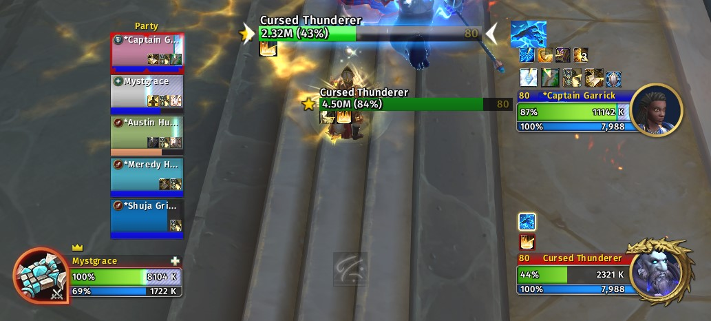
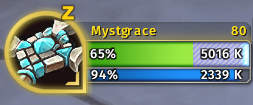
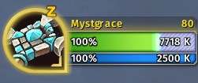

# Overshields Reforged

Overshields Reforged began as a fork of the [Overshields](https://github.com/enthh/overshields) addon by enthh, but turned into a rewrite.

Overshields Reforged adds information about shielding on Blizzard unit frames. Overshields Reforged displays the default UI's absorb shield overlay as an extra bar that overflows the standard health bars on Blizzard unit frames, which allows you to make more informed decisions on who to shield and when.

There are also a few options: Overshield overlay alpha (the striped absorb shield bar), overshield tick alpha (indicates overabsorb), and whether to show the overshield glow tick when a unit is not at full life.

Works with Blizzard's default Player, Target, Focus, Party, and Raid frames.

## Installation

### Addon Manager

Install from [CurseForge](https://www.curseforge.com/wow/addons/overshields-reforged).

### Manually

Download the [latest release](https://github.com/creed-us/Overshields_Reforged/releases/latest) and extract the `.zip` to your AddOns folder.

## License

Overshields is released under the [MIT License.](https://github.com/creed-us/Overshields_Reforged/blob/main/LICENSE)
