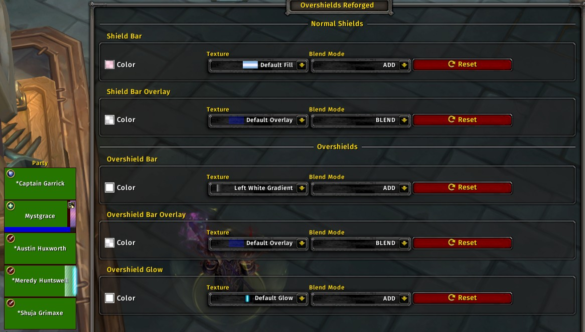

# Overshields Reforged

**Updated for World of Warcraft: Midnight, with some changes.**

Overshields Reforged began as a fork of the [Overshields](https://github.com/enthh/overshields) addon by enthh, but turned into a rewrite.

Overshields Reforged allows you to configure how absorbs & overabsorbs display on compact unit frames.

There are a couple of options: Color (including alpha/transparency), and texture. The old options which allowed you to pick when and how the overabsorb tick (the thick bar indicating that current shields/absorbs exceed missing HP) are gone due to new interface limitations in Midnight.

Works with Blizzard's default Player, Target, Focus, Party, and Raid frames.



## How to Use

Run **/overshieldsreforged options** or **/osr o** in your chat or press **Esc** and go to **Options > AddOns > Overshields Reforged**.

Run **/overshieldsreforged reset** or **/osr r** in your chat to reset all Overshields Reforged options. *This is recommended for users updating to the Midnight version.*

Run **/overshieldsreforged version** or **/osr v** in your chat to check the installed version of Overshields Reforged.

## Installation

### Addon Manager

Install from [CurseForge](https://www.curseforge.com/wow/addons/overshields-reforged).

### Manually

Download the [latest release](https://github.com/creed-us/Overshields_Reforged/releases/latest) and extract the `.zip` to your AddOns folder.

## FAQ

### Why is Overshields Reforged not working?

Overshields Reforged requires the "Display Incoming Heals" option to be enabled in order to function. This option allows the game to provide the necessary events for the addon to update the absorb shield overlays.

To enable Display Incoming Heals: Press **Esc** and go to **Options > Interface > Raid Frames**. Check the box for **Display Incoming Heals**.

Alternatively, you can enable it via this console command:

```
/console predictedHealth 1
```

### Does Overshields Reforged work with custom unit frame addons?

Overshields Reforged is designed to work with the built-in Blizzard unit frames. Custom unit frame addons - such as HealBot, VuhDo, Cell - may not be affected by this addon. Functionality should not be expected, and support for custom unit frame addons will not be provided or fixed, as it goes beyond the scope of this addon, and many unit frame addons provide their own methods of modifying the display of shields and overshields.

## License

Overshields is released under the [MIT License.](https://github.com/creed-us/Overshields_Reforged/blob/main/LICENSE)
