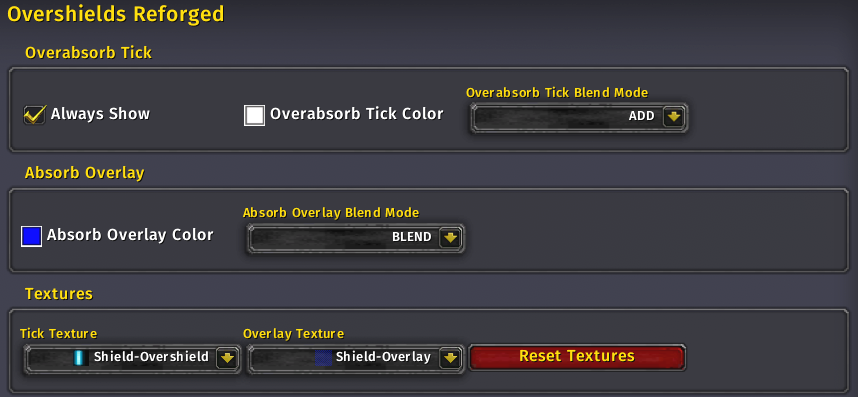

# Overshields Reforged

Overshields Reforged began as a fork of the [Overshields](https://github.com/enthh/overshields) addon by enthh, but turned into a rewrite.

Overshields Reforged adds information about shielding on Blizzard unit frames. Overshields Reforged displays the default UI's absorb shield overlay as an extra bar that overflows the standard health bars on Blizzard unit frames, which allows you to make more informed decisions on who to shield and when.

There are also a few options: Overshield overlay alpha (the striped absorb shield bar), overshield tick alpha (indicates overabsorb), and whether to show the overshield glow tick when a unit is not at full life.

Works with Blizzard's default Player, Target, Focus, Party, and Raid frames.




## How to Use

Run **/overshieldsreforged options** or **/osr o** in your chat or press **Esc** and go to **Options > AddOns > Overshields Reforged**.

Run **/overshieldsreforged version** or **/osr v** in your chat to check the installed version of Overshields Reforged.

## Installation

### Addon Manager

Install from [CurseForge](https://www.curseforge.com/wow/addons/overshields-reforged).

### Manually

Download the [latest release](https://github.com/creed-us/Overshields_Reforged/releases/latest) and extract the `.zip` to your AddOns folder.

## FAQ

### Why is Overshields Reforged not working?

Overshields Reforged requires the "Display Incoming Heals" option to be enabled in order to function. This option allows the game to provide the necessary events for the addon to update the absorb shield overlays.

To enable Display Incoming Heals: Press **Esc** and go to **Options > Interface > Raid Frames**. Check the box for **Display Incoming Heals**.

Alternatively, you can enable it via this console command:

```
/console predictedHealth 1
```

## License

Overshields is released under the [MIT License.](https://github.com/creed-us/Overshields_Reforged/blob/main/LICENSE)
