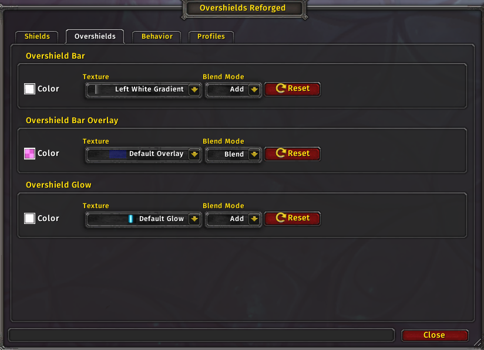

# Overshields Reforged

Overshields Reforged allows you to configure how shields & overshields appear on compact unit frames.

There are a couple of options: Color (including alpha/transparency), texture, and blend mode. There are also behavioral options that affect which compact unit frames are modified/affected by Overshields Reforged, as well as shield positioning dropdowns for shielded and overshielded states.

Works with Blizzard's **compact** raid/party/pet frames.



## How to Use

Run **/overshieldsreforged options** or **/osr o** in your chat or press **Esc** and go to **Options → AddOns → Overshields Reforged**.

Run **/overshieldsreforged reset** or **/osr r** in your chat to reset all Overshields Reforged options. _This is recommended for users updating to the Midnight version._

## Installation

### Addon Manager

Install from [CurseForge](https://www.curseforge.com/wow/addons/overshields-reforged).

### Manually

Download the [latest release](https://github.com/creed-us/Overshields_Reforged/releases/latest) and extract the `.zip` to your AddOns folder.

### Dependencies

It is recommended to install [LibSharedMedia](https://www.curseforge.com/wow/addons/libsharedmedia-3-0) (LSM) & [SharedMedia](https://www.curseforge.com/wow/addons/sharedmedia) to have access to extra texture options. Overshields Reforged does not add any statusbar or spark textures, but it will make use of any textures made available through LSM, in addition to those already available through the client.

## FAQ

### Why is Overshields Reforged not working?

Overshields Reforged requires the "Display Incoming Heals" option to be enabled in order to function. This option allows the game to provide the necessary events for the addon to update the shield overlays. To enable the "Display Incoming Heals" option, press **Esc** and go to **Options > Interface > Raid Frames**. Check the box for **Display Incoming Heals**. Alternatively, you can enable it via the following console command:

```
/console predictedHealth 1
```

### Does Overshields Reforged work with custom unit frame addons?

Overshields Reforged is designed to work with the built-in Blizzard unit frames. Custom unit frame addons - such as HealBot, VuhDo, Cell - may not be affected by this addon. Functionality should not be expected, and support for custom unit frame addons will not be provided or fixed, as it goes beyond the scope of this addon, and many unit frame addons provide their own methods of modifying the display of shields and overshields.

## License

Overshields is released under the [MIT License.](https://github.com/creed-us/Overshields_Reforged/blob/main/LICENSE)
